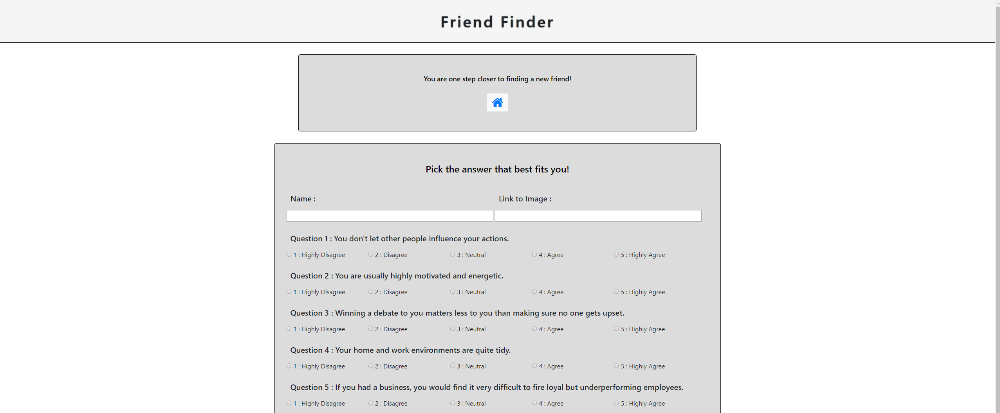
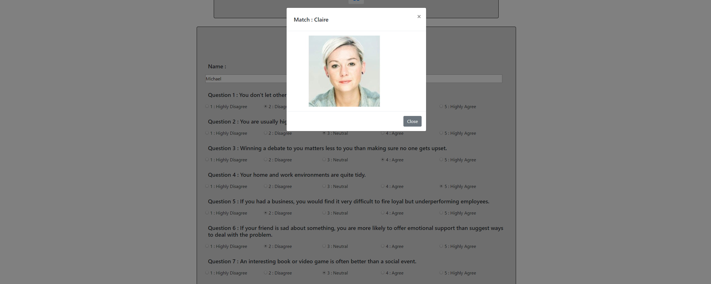

# Friend-Finder

https://personality-matching-ff.herokuapp.com/


A Node application that utilizes Express and Heroku in order for people to view images of individuals with similar personality traits to them.

### GETTING STARTED

#### BUILT-WITH

```
    Languages and Database :
    
    JAVASCRIPT
    JQUERY
    HTML / CSS / BOOTSTRAP
    
    Node Packages :
    
    body-parser : parse incoming request bodies in a middleware before your handlers, available under the req.body property
    express : fast, unopinionated, minimalist web framework for node
    path : an exact copy of the NodeJS ’path’ module
```

#### INSTALLATION GUIDE

The following packages need to be installed using the following commands :

```
    npm install body-parser
    npm install express
    npm install path
```

##### Sample Friends

You can find a list of all the friends here :
https://personality-matching-ff.herokuapp.com/api/friends

```json
[
    {
        "name": "Jeff",
        "photo": "https://vignette.wikia.nocookie.net/althistory/images/7/74/Recent-portraits-random-people-in-random-places_11.jpg/revision/latest?cb=20141209232111",
        "scores": [5, 1, 4, 4, 5, 1, 2, 5, 4, 1]
    },
    {
        "name": "Peter",
        "photo": "http://pm1.narvii.com/5866/45cc61eb9e3eaefdc26be045e9f9fbfdf916f45b_00.jpg",
        "scores": [4, 2, 1, 3, 2, 5, 4, 4, 2, 2]
    },
    {
        "name": "Claire",
        "photo": "https://www.rd.com/wp-content/uploads/2017/03/22-People-Share-the-Random-Act-of-Kindness-That-Changed-Their-Life-Polly-380x254.jpg",
        "scores": [3, 2, 3, 3, 4, 5, 2, 3, 4, 5]
    },
    {
        "name": "Rachel",
        "photo": "https://dz9yg0snnohlc.cloudfront.net/new-the-enjoyable-art-of-learning-to-talk-to-random-people-2.png",
        "scores": [4, 1, 3, 2, 4, 3, 4, 1, 5, 4]
    },
    {
        "name": "Gary",
        "photo": "http://www.garyparker.com/users/GaryParker3765/largerThumbs/GaryParker37651642786T.jpg",
        "scores": [1, 4, 2, 4, 5, 5, 5, 3, 1, 2]
    },
    {
        "name": "John",
        "photo": "https://secure.gravatar.com/avatar/9f4451afa3ce4be72f4ec8227bd8d320?s=400&d=mm&r=g",
        "scores": [2, 2, 1, 4, 5, 5, 4, 3, 2, 5]
    },
    {
        "name": "Rebecca",
        "photo": "https://i.pinimg.com/736x/63/48/b3/6348b3d5a126d45380367bbd12948fc4--tops-people.jpg",
        "scores": [4, 5, 4, 3, 2, 5, 4, 3, 1, 5]
    },
    {
        "name": "Lily",
        "photo": "https://cdn-01.belfasttelegraph.co.uk/life/weekend/article35579384.ece/85e51/AUTOCROP/w620h342/2017-04-01_lif_29877253_I2.JPG",
        "scores": [3, 5, 1, 3, 5, 4, 2, 5, 4, 3]
    }
]
```

### WEBSITE AND IMAGES

#### Home Page

On this Home Page, individuals will have the opportunity to view a list of potential friends in JSON format or go straight into the survey and be matched.


#### Survey Page

Users are given 10 short questions that reflect an individual's personality. Each question has 5 different answer choices that reflect how much the user agrees with the statement.



#### Match Page

At the end of the survey, using an algorithm that compares the total difference between each question, we provide the user with a match.



### TO-DO / BUGS
- Make images more responsive depending on size within the match's modal.
